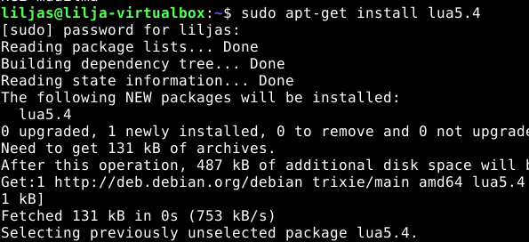

# h7-Maalisuora

## Sisältö

[a) Hei Maailma](#a-Hei-Maailma)

[b) Lähdeviitteet](#b-Lähdeviitteet)

[c) Komento](#c-Komento)

[d) Laboratorioharjoitus](#d-Laboratorioharjoitus)

### Koneen tekniset tiedot
* Prosessori: Intel Core i5-8265U CPU @ 1.60 GHz (1.80 GHz turbo, 8 ydintä)
* RAM: 16 GB (15,7 GB käytettävissä)
* Järjestelmä: Windows 11 Pro 64-bittinen (x64-suoritin)
* Näytönohjain: Intel UHD Graphics 620
* Tallennustila: 237 GB, josta 158 GB vapaana
* DirectX-versio: DirectX 12

# a) Hei Maailma

Lähdin tässä tehtävänosiossa 1.10.2025 kello 18:40 etenemään seuraavasti. Tarkoitus oli siis kirjoittaa ja ajaa kolmella kielellä.

Tässä käytin Karvisen (2018) ohjeistusta ja tunnilla samaan aikaan opittua.

## Python

Tähän kieleen olikin jo aikaisemmin kerennyt tutustua. Se oli asennettuna jo valmiiksi, joten jätän asennusvaiheen tässä osiossa pois.

Loin tiedoston
* **`nano hello.py`** 

Kirjoitin sisällön
* **`print ("Hei maailma")`**
  - Ctrl + O
  - Ctrl + X

Ajoin sen
* **`python3 hello.py`** - 

_Nanoon haluttu sisältö_

_Nätisti tulostui_

## Bash

Tätä kerkesin jo kokeilla tunnin aikana Johannan opastuksella.

Tiedoston luominen
* **`nano hello.sh`** 

Sisältö koodeineen sinne
* **`#!/bin/bash 
echo "Hei maailma"`**
  - Ctrl + O
  - Ctrl + X

Annoin oikeudet ajamiseen
* **`chmod +x hello.sh`** 

Ajoin sisällön
* **`./hello.sh`** 

_Komennot prosessissa_

## Lua

Asensin sen ensin 
* **`sudo apt-get install lua5.4`**
  - syötin salasanan ja Enter
  

_Lua asennusta_

Loin tiedoston 
* **`nano hello.lua`**

_Nanon sisältö_

Sisältö sinne
* **`print("Hei maailma")`**
  - Ctrl + O
  - Ctrl + X

Ajoin sisällön
* **`print("Hei maailma")`** 

_Lua:lla tulostusta_

# b) Lähdeviitteet

* Tämä tehtävänosio oli jo tehty tätä raporttia kirjoittaessa, sillä vittasin kaikkin lähteisiin ohjeistusten mukaisesti niitä tehdessä. 

# c) Komento

# d) Laboratorioharjoitus

# Lähteet

Karvinen, T. 2025. Verkkosivu. Linux Palvelimet 2025 alkusyksy Luettavissa: https://terokarvinen.com/linux-palvelimet/ Luettu: 20.08.2025.

Karvinen, T. 2018. Verkkosivu. Luettavissa: https://terokarvinen.com/2018/hello-python3-bash-c-c-go-lua-ruby-java-programming-languages-on-ubuntu-18-04/ Luettu: 1.10.2025.

h7 Maalisuora
a) Kirjoita ja aja "Hei maailma" kolmella kielellä.
c) Laita Linuxiin uusi, itse tekemäsi komento niin, että kaikki käyttäjät voivat ajaa sitä.
d) Ratkaise vanha arvioitava laboratorioharjoitus soveltuvin osin.
Jos haluat tehdä vapaaehtoisen tehtävän h8, sen määräaika on sama kuin h7.

Vinkit:

Karvinen 2018: Hello World Python3, Bash, C, C++, Go, Lua, Ruby, Java – Programming Languages on Ubuntu 18.04
Uuden komennon saat ajettavaksi Karvinen 2007: Shell Scripting, ja kaikille kopioimalla sen pääkäyttäjänä kansioon /usr/local/bin/
Muistaakseni ohjelmointikielien paketit Debian 12-bookworm:ssa ovat 'sudo apt-get install python3 gcc g++ openjdk-17-jdk golang-go ruby lua5.4'
Vanhoja arvioitavia laboratorioharjoituksia löytyy Teron sivujen omalla hakutoiminnolla, Googlella ja DuckDuckGolla.
Vanhoissa labroissa voi olla osia, joita ei ole käsitelty tällä toteutuksella. Voit soveltaa, vaihtaa tai hypätä yli noista osista.
Muista aina hyvät salasanat. Älä jätä käyttäjien kotihakemistoihin root:in omistamia tiedostoja. Testaa kaikki mitä olet tehnyt.
