# h7-Maalisuora

## Sisältö

[a) Hei Maailma](#a-Hei-Maailma)

[b) Lähdeviitteet](#b-Lähdeviitteet)

[c) Komento](#c-Komento)

[d) Laboratorioharjoitus](#d-Laboratorioharjoitus)


### Koneen tekniset tiedot
* Prosessori: Intel Core i5-8265U CPU @ 1.60 GHz (1.80 GHz turbo, 8 ydintä)
* RAM: 16 GB (15,7 GB käytettävissä)
* Järjestelmä: Windows 11 Pro 64-bittinen (x64-suoritin)
* Näytönohjain: Intel UHD Graphics 620
* Tallennustila: 237 GB, josta 158 GB vapaana
* DirectX-versio: DirectX 12


# a) Hei Maailma

Lähdin tässä tehtävänosiossa 1.10.2025 kello 18:40 etenemään seuraavasti. Tarkoitus oli siis kirjoittaa ja ajaa kolmella kielellä. 

Tässä käytin Karvisen (2018) ohjeistusta ja tunnilla samaan aikaan opittua.

Valitsin hänen ohjeestaan Pythonin, Bashin ja Luan.

## Python

Kävin alkuun asentamassa kaikki ohjelmakielien paketit:

* **`sudo apt-get install python3 gcc g++ openjdk-17-jdk golang-go ruby lua5.4`**

Loin tiedoston
* **`nano hello.py`** 

Kirjoitin sisällön
* **`print ("Hei maailma")`**
  - Ctrl + O
  - Ctrl + X

Ajoin sen
* **`python3 hello.py`** 

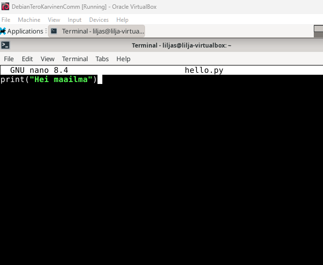

_Nanoon haluttu sisältö_

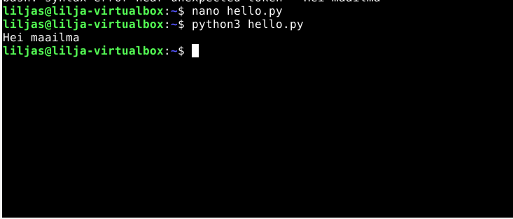

_Nätisti tulostui_

## Bash

Tätä kerkesin jo kokeilla tunnin aikana Johannan opastuksella.

1. Tiedoston luominen
* **`nano hello.sh`** 

2. Sisältö koodeineen sinne
* **`#!/bin/bash 
echo "Hei maailma"`**
  - Ctrl + O
  - Ctrl + X

3. Annoin oikeudet ajamiseen
* **`chmod +x hello.sh`** 

4. Ajoin sisällön
* **`./hello.sh`** 

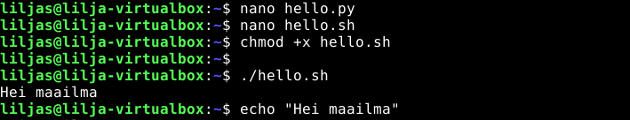

_Komennot prosessissa_

## Lua

1. Asensin jo tosiaan kaikki alla olevalla komennolla:
* **`sudo apt-get install python3 gcc g++ openjdk-17-jdk golang-go ruby lua5.4`**
  - syötin salasanan ja Enter

2. Loin tiedoston 
* **`nano hello.lua`**

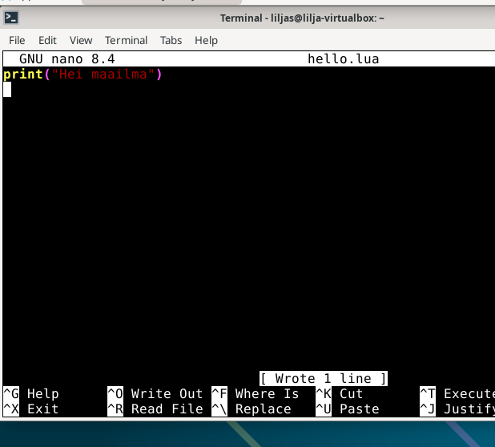

_Nanon sisältö_

3. Sisältö sinne
* **`print("Hei maailma")`**
  - Ctrl + O
  - Ctrl + X

4. Ajoin sisällön
* **`print("Hei maailma")`** 

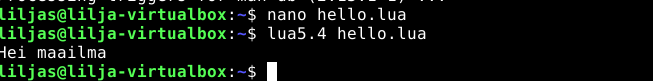

_Lua:lla tulostusta_


# b) Lähdeviitteet

* Tämä tehtävänosio oli jo tehty tätä raporttia kirjoittaessa, sillä vittasin kaikkin lähteisiin ohjeistusten mukaisesti niitä tehdessä. 

# c) Komento

Tähän tehäväosioon siirryin samana päivänä 1.10.2025 kello 19:22.

### Skripti

Tätäkin tehtävänosaa seurasin tunnin aikana, jota oli helppo tehdä tässä samalla.

1. Loin tiedoston `Tervetuloa` nanolla komennolla:
* **`nano Tervetuloa`**

2. Sisältöä skriptiin
* **`#!/bin/bash`
echo "Tervetuloa Linuxiin!"`**
  - Ctrl + O
  - Ctrl + X

3. Annoin oikeudet ajamiseen
* **`chmod +x Tervetuloa`**

4. Kopioin käyttäjille skriptin pääkäyttäjän roolissa
* **`sudo cp Tervetuloa /usr/local/bin/`**

5. Ajetaan ja testausta
* **`Tervetuloa`**

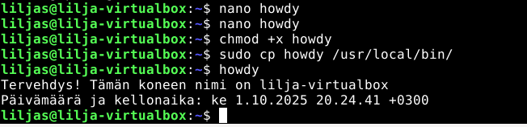

_Yllä oleva prosessi kuvina eli tehty komentoni_
  
# Vanha laboratorioharjoitus

[d) howdy](#d-howdy)

[e) Etusivu uusiksi](#e-Etusivu-uusiksi)

[g) Salattua hallintaa](#g-Salattua-hallintaa)

[h) Djangon lahjat](#h-Djangon-lahjat)

Saman päivänä 1.10.2025 siirryin kello 19:57 tämän osion pariin. 

Valitsin _Final Lab for Linux Palvelimet 2024 Spring_ eli viime vuoden kevään laboratorioharjoituksen ja sovelsin sitä ohjeistuksen mukaan tarvittaessa.

## d) 'howdy'

`Tehtävänantona oli:
- Tee kaikkien käyttäjien käyttöön komento 'howdy'
- Tulosta haluamaasi ajankohtaista tietoa, esim päivämäärä, koneen osoite tms
- Pelkkä "hei maailma" ei riitä
- Komennon tulee toimia kaikilla käyttäjillä työhakemistosta riippumatta`

Tästä tein ylempää juuri vastaavan, joten tämä osuus oli vielä erittäin hyvin muistissa.

1. Päivitin ensin paketit välissä
* **`sudo apt-get update`**

2. Nanolla tiedosto 
* **`nano howdy`**

3. Annoin oikeudet ajoon
* **`chmod +x howdy`**

4. Kopioin käyttäjille skriptin pääkäyttäjän roolissa
* **`sudo cp howdy /usr/local/bin/`**

5. Testaus
* **`howdy`**


_Onnistunut komennolla tulostus_


## e) Etusivu uusiksi

Tässä tehtäväosiossa hyödynsin omaa raporttiani h3 Hello Web Server ja Karvisen (2018) ohjetta.

Tämäkin vaihe meni kyllä todella hyvin ulkomuistista suurimmalta osin.

1. Pakettien päivitystä
* **`sudo apt-get update`**

Apache on jo asennettu, joten sitä prosessia en tässä kohtaa raporttia käy läpi.


2. Loin uuden kansion kotihakemistoon ja kirjoitin web-sivun sisällön index.html tiedostoon nanolla
* **`mkdir -p ~/public_html`**
* **`nano ~/public_html/index.html`**

Sisältö on alla oleva sillä halusimme tehtävänosiossa kotisivn "Al Kakone":

```
<!DOCTYPE html>
<html>
<head>
    <title>AI Kakone</title>
</head>
<body>
    <h1>Tervetuloa AI Kakoneen kotisivulle!</h1>
</body>
</html>
```


* **`hostname -I`** komennolla muistelin virtuaalikoneen IP-osoitetta joka oli `10.0.2.15`.
  

Tässä kohtaa ilmeni virhetilanne.

Olin kirjoittanut virtuaalikoneen internet-selaimen hakukenttään `10.0.2.15` oikean `http://10.0.2.15/~liljas/` sijaan. 

Se vei minut väärälle sivulle eli **oletushakemiston HTML-sisältöön, eikä juuri luomaani käyttäjän liljas sisältöön**.

Tajusin onneksi nopeasti virhetilanteen, ja pääsin hienosti alla olevaan näkymään:

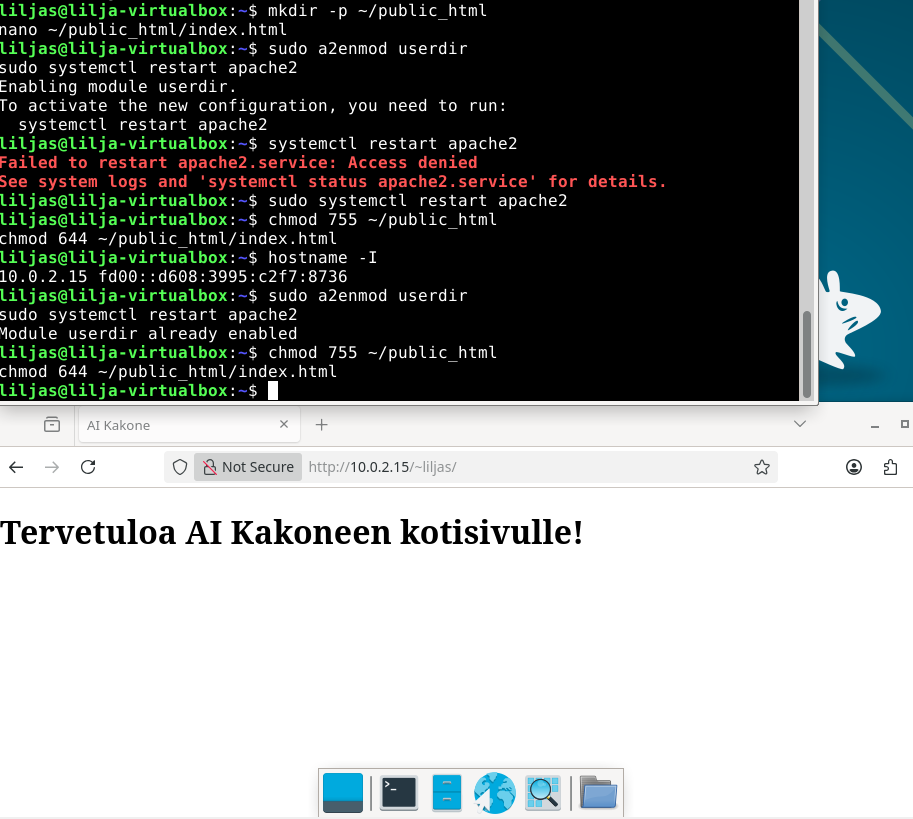

_Uusi Al Kakone kotisivu_


## g) Salattua hallinta

Tähän tehtävänatoon siirryin samana päivänä kello 20:45.

Tätä tehtävässä hyödynsin osittain ulkomuistia, omaa h4 Maailma kuulee tehtävää, AskUbuntua (2013) ja DigitalOcean (2025 & 2016) ohjeita. 

- Asenna ssh-palvelin
- Tee uusi käyttäjä omalla nimelläsi, esim. minä tekisin "Tero Karvinen test", login name: "terote01"
- Automatisoi ssh-kirjautuminen julkisen avaimen menetelmällä, niin että et tarvitse salasanoja, kun kirjaudut sisään. Voit käyttää kirjautumiseen localhost-osoitetta

1. Pakettien päivitystä
* **`sudo apt-get update`**

2. OpenSSH asennusta, käyttöönottoa ja tarkistusta
* **`sudo apt-get install openssh-server`**
* **`sudo systemctl enable ssh`**
* **`sudo systemctl start ssh`**
* **`sudo systemctl status ssh`**

3. Käyttäjän luonti pääkäyttäjänä ja varuiksi vielä oikeudet
* **`sudo adduser liljas`**
* **`sudo chown -R liljas:liljas /home/nimi01`**

4. SSH automatisointi
* **`ssh-keygen`**
* **`ssh-copy-id liljas01@localhost`**
  - Syötin salasanan ja kirjauduin ulos välissä
 
* **`ssh liljas01@localhost`**

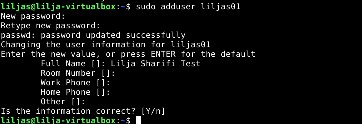

_Uuden käyttäjän luomista_

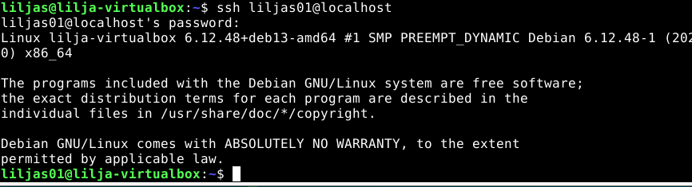

_Onnistunut lopputulos eli kirjautuminen vain passilla_

5. Portin tarkistusta ja vaihtamista

* **`sudo nano /etc/ssh/sshd_config`**
  - Salasana ja Enter
  - #Port 22 -> Pois "#" merkki ja "Port 1337" tilalle.
  - Ctrl O + Enter + Ctrl X
 
Nyt portti 1337 on konfiguroitu. 

6. Tarkistusta `sudo sshd -t` komennolla ja käynnistystä perään `sudo systemctl restart ssh`

7. Palomuuriin reikä ja sallitaan kyseinen uusi portti `1337`
* **`sudo ufw allow 1337/tcp`** 
* **`sudo ufw reload`**
* **`sudo ufw status`**

Lopuksi tarkistus komennolla:
* **`ssh -p 1337 liljas01@localhost`**
  - Salasana ja Enter
 
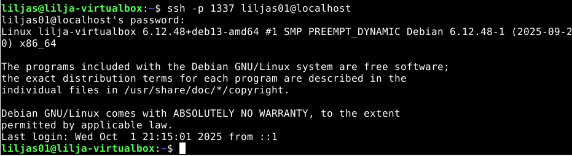

_SSH toimii nyt portilla 1337_

## h) Djangon lahjat

Tähän tehtävänantoon etenin samana päivänä kello 21:50. Edellisessä tehtävässä joutui hieman tutkiskelemaan SSH serverin portin vaihtoa, joten siirtymään tuli viivettä.

Tässä osiossa hyödynsin DedicatedCoren (2024) ohjevideota,  Django REST framework verkkosivua, sekä RealPythonia (2024).

Tehtävänantona oli:
`Asenna omalle käyttäjällesi Django-kehitysympäristö
-Tee tietokantaan lista tekoälyistämme, jossa on nämä ominaisuudet
-Kirjautuminen salasanalla
-Tietokannan muokkaus wepissä Djangon omalla ylläpitoliittymällä (Django admin)
-Käyttäjä Erkille, jossa ei ole ylläpito-oikeuksia
-Taulu Assistants, jossa jokaisella tietueella on nimi (name)
-Jos haluat, voit lisäksi bonuksena laittaa mukaan kentän koko (size)`

1.  Asennus ja loin kansion
* **`sudo apt-get install python3-pip python3-venv`** 
* **`mkdir django`** - polulle /home/liljas/django
* **`cd django`** - siirryin kansioon

2. Virtualenv asennuksia
* **`python3 -m venv env`** - luodaan ympäristö
* **`source env/bin/activate`** - virtuaaliympäristön aktivointi
* **`pip install -r requirements.txt`** - asennus
* **`micro requirements.txt*** - tiedoston luontia
* **`django`** - teksti sisälle ja Ctrl + S ja Ctrl + Q

3. Django projektin aloittaminen
* **`django-admin startproject Lahjoitukset`** - uusi proekti
* **`cd Lahjoitukset`** 
* **`./manage.py runserver`** - käynnistän serverin
* **`source env/bin/activate`** - aktivoin ympäristön
* **`http://127.0.0.1:8000/`** - näkyi hienosti raketti, testasin osoitteen virtuaalikoneen internet-selaimessa


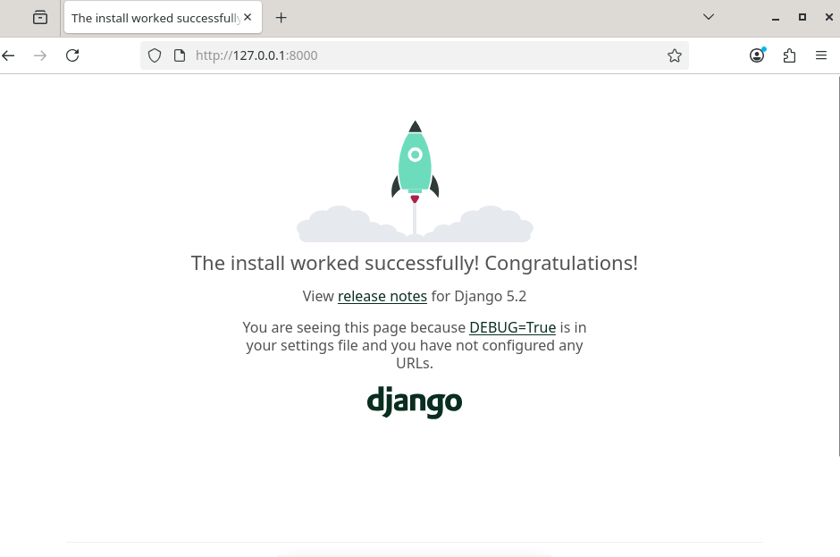

_Onnistunut asennus_

4. Hallintasivu (admin) tietokannassa
* **`./manage.py makemigrations`**
* **`./manage.py migrate`**
* **`./manage.py createsuperuser`**
* **`./manage.py runserver`**
  - Käyttäjätunnukseksi: admin
  - Salasanaksi: perttipannukakkuporkkanaleipä255!
* * **`http://127.0.0.1:8000/admin`** Lopuksi vielä testaus kirjautumalla sisään onnistuneesti. 

6. Erkin käyttäjän luominen ja aktivointi ilman admin oikeuksia
* **`/manage.py shell`** avasin django shellin
* Käyttäjätunnus: Erkki
* Salasana: porkkanakeppiperunalanttunauris
```from django.contrib.auth.models import User
erkki = User.objects.create_user(username='Erkki', password='porkkanakeppiperunalanttunauris')
erkki.is_staff = True
erkki.is_superuser = False
erkki.save()
exit()
```
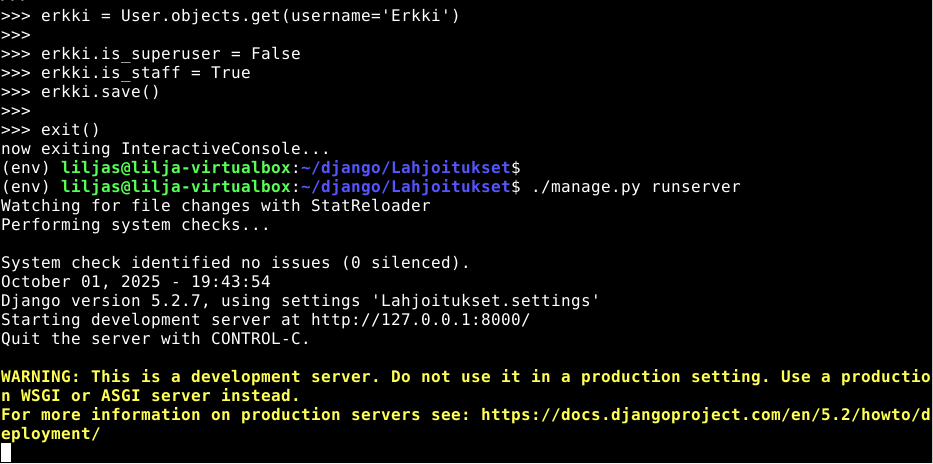

_Erkki käyttäjän lisääminen onnistunut_

7. Tietokanta
**`./manage.py startapp tietokanta`** - sovelluksen luontia
**`nano Lahjoitukset/settings.py`** 
 - Lisäsin INSTALLED_APPS osion viimeiselle riville `tietokanta` ja Ctrl + O ja Ctrl + X
* **`mkdir -p tietokanta/templates/tietokanta`** - loin HTML tiedoston johon laitan sisällön
* **`nano tietokanta/templates/tietokanta/home.html`** - HTML tietojen näyttäminen
* **`nano tietokanta/models.py`** - luokat sinne nanoa käyttäen ja Ctrl + O ja Ctrl + X
* **`nano tietokanta/admin.py`** - rekisteröidään luotu kanta
* **`./manage.py makemigrations`** tietojen tallentaminen
* **`./manage.py migrate`** - muutosten käyttöönotto 
* **`./manage.py runserver`** - serveri käyntiin

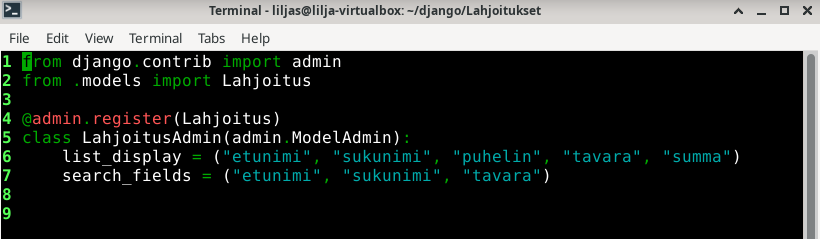


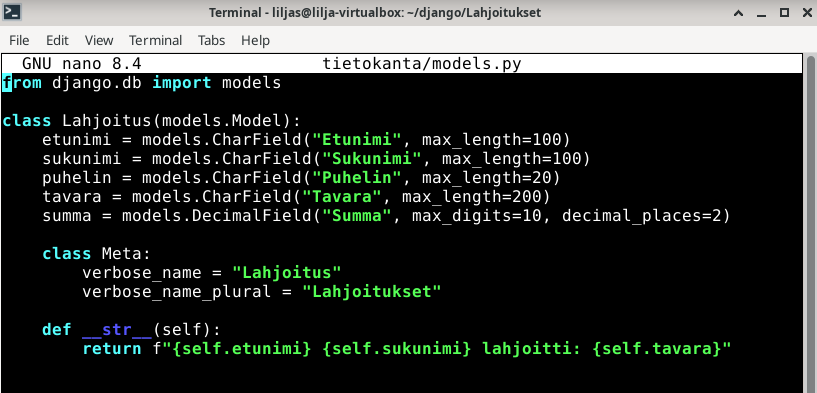

  _Luokat_

* Tietokantaan lahjoitukset oikeus Erkille kirjautumalla superuserina sivustolle **`http://127.0.0.1:8000/admin`** 
  - Users
  - Staff status valittuna
  - Can add lahjoitus
  - Can change lahjoitus
  - Can delete lahjoitu
  - Can view lahjoitus
 
### Lopputulos ja omapohdinta

Olin tässä harjoituksessa nyt oppinut asentamaan Django-kehitysympäristön:
- Loin projektin
- Loin yksinkertaisen sivuston
- Loin superuserin jolla hallintaoikeudet
- Loin käyttäjän (Erkki) joka pystyi kirjautumaan käyttäjänä
- Loin sivustolle lomakesivun johon voi syöttää tietoja ja katsella niitä

Tämä tehtävänanto oli mielenkiintoinen ja siinä pääsikin harjoittelemaan hieman ulkomuistissa olevaa, mutta myös virkistämään muistia ja läpikäymään ohjeita ja käymään läpi omiakin raportteja.

Eniten nautin Django 4- kehitysympäristöstä, sillä se oli täysin uusi asia minulle (kuten kaikki kurssin aiheetkin) mutta oli hienoa nähdä konkreettisesti yksinkertainen sivu muodostumassa pikkuhiljaa.

Jatkoin tätä raportin tehtävänantoa seuraavana päivänä 2.10.2025. Kello 17:40 ja valmiiksi tuli kello 18:42.

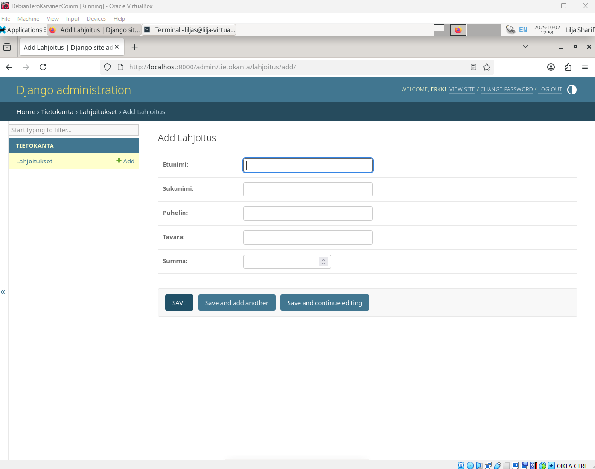

# Lähteet
AskUbuntu. 2013. Keskustelufoorumi. _How to run the SSH server on a port other than 22_ Luettavissa: https://askubuntu.com/questions/264046/how-to-run-the-ssh-server-on-a-port-other-than-22/ Luettu: 1.10.2025.

DedicatedCore. 2023. Youtube. _How To Install Django on Ubuntu 22.04 LTS | Install Django on Linux (Step by Step)_ Katsottavissa: https://www.youtube.com/watch?v=OHZZkGK0bZM Katsottu: 1.10.2025.

DigitalOcean. 2025. Verkkosivu. _How do I change my Droplet's SSH port?_ Luettavissa: https://docs.digitalocean.com/support/how-do-i-change-my-droplets-ssh-port/ Luettu: 1.10.2025.

DigitalOcean. 2025. Verkkosivu. _How to Use SSH to Connect to a Remote Server (Step-by-Step Guide)_ Luettavissa: https://www.digitalocean.com/community/tutorials/how-to-use-ssh-to-connect-to-a-remote-server/ Luettu: 1.10.2025.

DigitalOcean. 2025. Verkkosivu. _How to Set Up SSH Keys on Ubuntu: A Comprehensive Guide_ Luettavissa: https://www.digitalocean.com/community/tutorials/how-to-set-up-ssh-keys-on-ubuntu-22-04/ Luettu: 1.10.2025.

Django REST framework. _Quickstart_ Luettavissa: https://www.django-rest-framework.org/tutorial/quickstart/ Luettu: 1.10.2025.

Karvinen, T. 2025. Verkkosivu. _Linux Palvelimet 2025_ alkusyksy Luettavissa: https://terokarvinen.com/linux-palvelimet/ Luettu: 20.08.2025.

Karvinen, T. 2018. Artikkeli. Name Based Virtual Hosts on Apache – Multiple Websites to Single IP Address Luettavissa: https://terokarvinen.com/2018/04/10/name-based-virtual-hosts-on-apache-multiple-websites-to-single-ip-address/ Luettu: 05.09.2025.

Karvinen, T. 2018. Verkkosivu. _Hello World Python3, Bash, C, C++, Go, Lua, Ruby, Java – Programming Languages on Ubuntu 18.04_ Luettavissa: https://terokarvinen.com/2018/hello-python3-bash-c-c-go-lua-ruby-java-programming-languages-on-ubuntu-18-04/ Luettu: 1.10.2025.

Karvinen, T. 2024. Verkkosivu. _Final Lab for Linux Palvelimet 2024 Spring_ Luettavissa: https://terokarvinen.com/2024/arvioitava-laboratorioharjoitus-2024-linux-palvelimet/ Luettu: 1.10.2025

Karvinen, T. 2017. Verkkosivu. First Steps on a New Virtual Private Server – an Example on DigitalOcean and Ubuntu 16.04 LTS Luettavissa: https://terokarvinen.com/2017/first-steps-on-a-new-virtual-private-server-an-example-on-digitalocean/ Luettu 13.09.2025.

RealPython. 2024. Verkkosivu. _Python Virtual Environments: A Primer_ Luettavissa: https://realpython.com/python-virtual-environments-a-primer/ Luettu: 1.10.2025.

Sharifi, L. 2025. Raportti. _h4 Maailma kuulee_ Luettavissa: https://github.com/LilJayyy/h4-Maailma-kuulee/edit/main/Palautus.md Luettu: 1.10.2025. 

Sharifi, L. 2025. Raportti. _h3 Hello Web Server_ Luettavissa: https://github.com/LilJayyy/h3-Hello-Web-Server/blob/main/Palautus.md Luettu: 1.10.2025.
